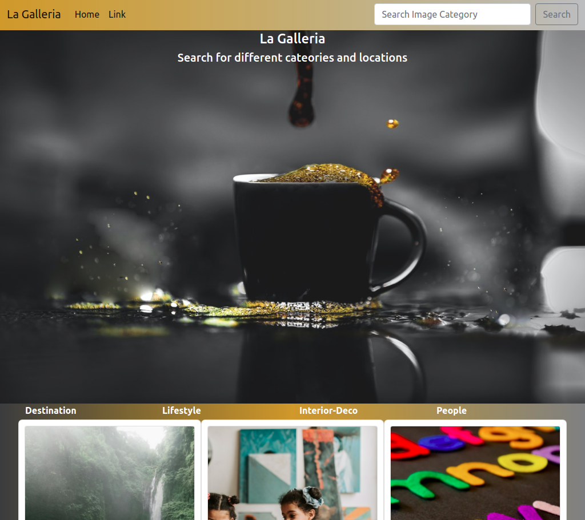
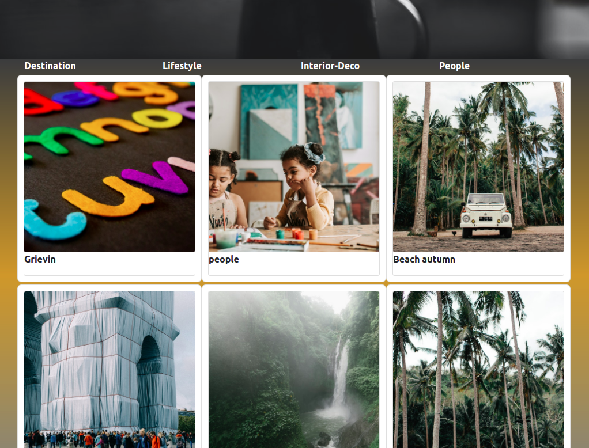
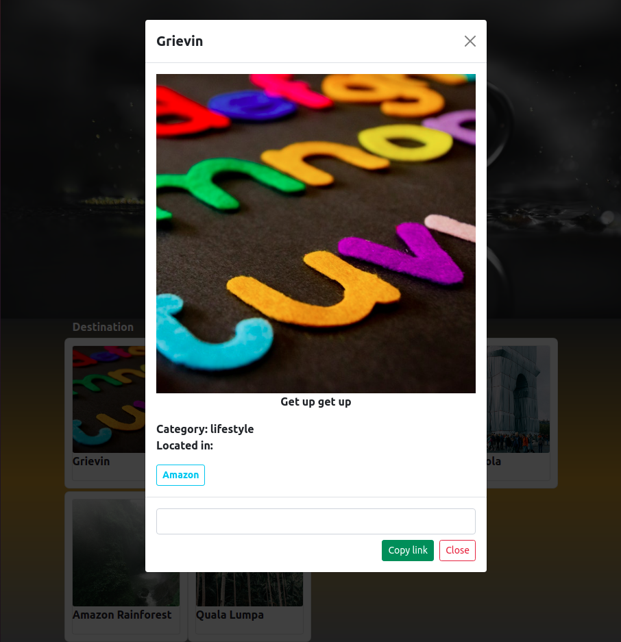
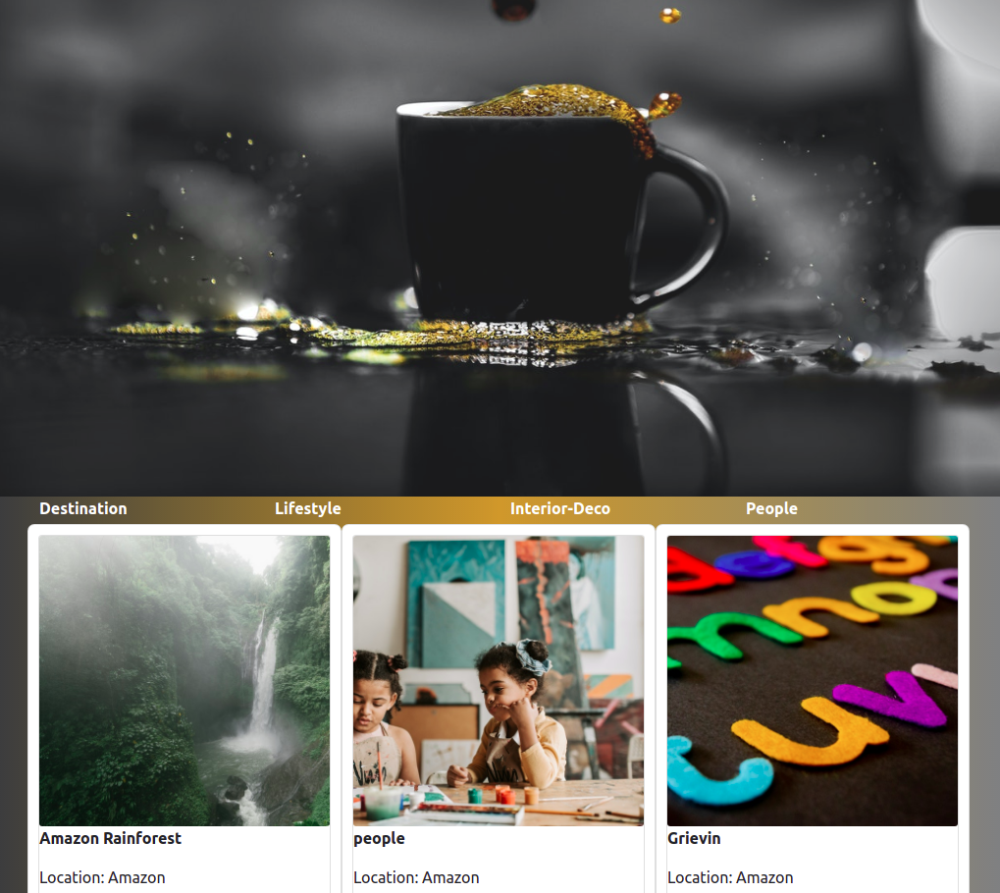
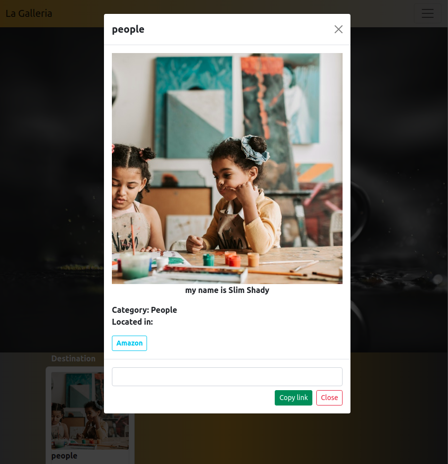
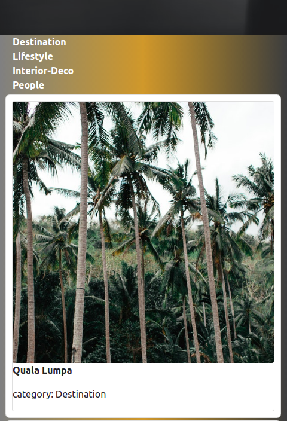
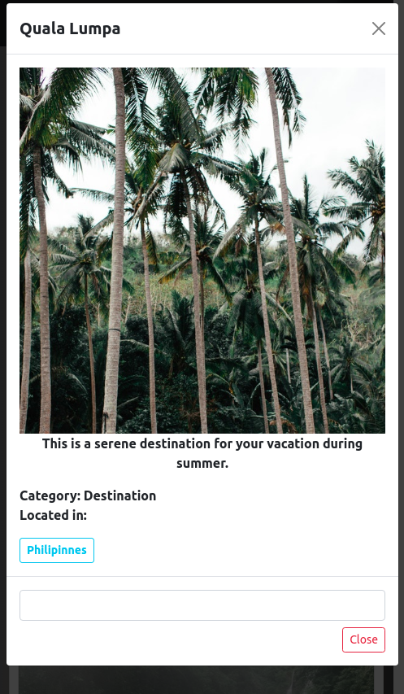

# Personal-Galleria

### Created by Grievin Otieno on 10/10/2021

## Description

A personal Galleria is a simple dango application that displays a photo gallery to show beautiful images . Users get to view photos updated by the site admin. Users can see photos based on the location, by clicking on the listed locations in the image and you can copy the link too. The search function will search photos based on the categories.

## Setup Requirements

* Git
* Github
* PostgreSQL
* Django
* Python 3.8
* Pip
* Web-browser or your choice

## Setup Installation
* Copy The Repository url
* Clone it tomyour PC
* open in terminal and Run the following command after navigating to the cloned project in your PC
* run the fllowing commands

python3.8 -m venv virtual

* Activate your virtual Environment

source virtual/bin/activate

curl https://bootstrap.pypa.io/get-pip.py | python

pip install -r requirements.txt

* To run the server 

python manage.py runserver

* Open the browser and navigate to http://127.0.0.1:8000/ to see the application in action

## Technologies Used

* Python
* Django
* PostgreSQL
* Bootstrap
* HTML
* CSS

## Preview of the project

* landing page

 

* click the image

* filter by location

* search by category

*  Phone responsiveness

## Support and contact details
Lets interact, Work Together or Contribute to my code, catch me @ 
* enogroti@gmail.com or d+254714880548

## License

MIT Copyright (c) 2021 Grievin Otieno

